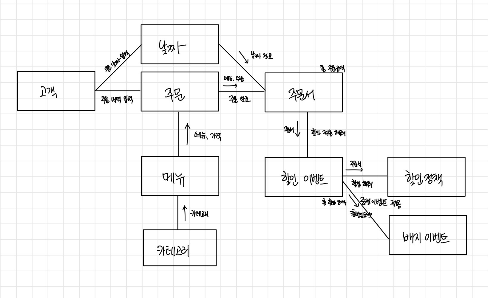

# 🎄 크리스마스 프로모션

## 👨‍👨‍👧‍👧 객체 협력 한눈에 보기

## 1단계 : 사용자에게 제공해야하는 시스템 책임 파악하기
- 12월 날짜 선택(1 - 31일까지)
- 메뉴 주문 받기(음료만 주문 불가능)
- 주문한 메뉴 조회
- 주문 메뉴 총 주문금액 조회
- 12월 이벤트 할인 적용(총 주문 금액 10000원이상 적용)
    - 크리스마스 디데이 할인 - 25일까지 100원씩 할인 - 날짜 정보 필요
    - 평일할인 - 평일 "디저트메뉴" 2023원 할인 - 주문메뉴와 날짜 정보 필요
    - 주말할인 - 금, 토 "메인메뉴" 2023원 할인 - 주문메뉴와 날짜정보 필요
    - 특별할인 - 달력에 별이 있다면 1000원 - 이벤트 날짜 정보와 입력받은 날짜 정보 필요
    - 증정 이벤트 - 12만원 이상 구매시 샴페인 증정 - 총 주문금액 필요(할인 전)
- 증정 이벤트에 따른 증정 메뉴 조회
- 할인 적용에 따른 해택내역 조회
- 총 할인 금액 조회
- 할인 후 총 결제금액 조회
- 혜택 받은 금액에 따른 이벤트 증정 배지 조회

## 2단계 : 시스템 책임을 더 작은 책임으로 분할
- 12월 날짜를 입력받는다.
    - 숫자가 아닌 경우 예외가 발생
    - 1 - 31일이 아닐 경우 예외가 발생
    - 날짜 정보에 대한 객체를 생성한다.
- 메뉴와 수량을 주문 받는다.
    - 입력 시, ","기준으로 메뉴를 입력받기 -> 예외 시 잘못된 입력방식 출력
    - 메뉴-수량에 대한 정보를 key-value쌍으로 리스트에 저장한다
    - 중복된 메뉴를 입력한 경우 예외가 발생
    - 주문 메뉴가 음료만 포함되어 있을 시 예외가 발생
    - 주문한 메뉴가 실제 메뉴에 포함된 메뉴가 아니라면 예외가 발생
    - 주문한 수량이 1개보다 적다면 예외가 발생
    - 주문한 수량이 20개 이상이면 예외가 발생
    - 주문한 메뉴와 수량에 대한 주문서 객체를 생성
- 주문한 메뉴를 출력한다.
    - 주문한 메뉴 리스트를 조회한다.
    - 조회한 주문메뉴 리스트를 출력한다.
- 총 주문 금액을 출력한다.
    - 주문한 메뉴와 수량으로 총 금액을 계산한다.
    - 총 금액을 조회한다.
    - 총 금액을 출력한다.
- 할인 혜택을 적용한다.
    - 날짜 정보를 받아 크리스마스 할인정책을 적용한다.
    - 날짜 정보와 주문한 메뉴 정보를 받아 평일 할인정책을 적용한다.
    - 날짜 정보와 주문한 메뉴 정보를 받아 주말 할인정책을 적용한다.
    - 날짜 정보를 받아 특별 할인 정책을 적용한다.
    - 총 주문 금액을 통해 상품 증정 여부를 확인한다.
        - 증정 메뉴에 샴페인을 추가한다.
    - 적용된 할인 혜택 내역을 조회한다.
    - 적용된 할인 혜택 내역을 출력한다.
    - 총 할인 혜택 금액을 조회한다.
    - 총 할인 혜택 금액을 출력한다.
- 할인 혜택 후 예상 결제 금액을 출력한다.
    - 주문금액에서 해택 금액을 뺸다.
    - 할인 혜택 후 결제 금액을 조회한다.
    - 할인 혜택 후 결제 금액을 출력한다.
- 총 혜택 금액에 따라 배지를 증정한다.
    - 총 혜택 금액을 조회한다.
    - 금액에 따른 배지를 조회한다.
    - 증정할 배지를 출력한다.

## 3단계 : 분할된 책임을 수행할 수 있는 적절한 객체 또는 역할을 찾아 책임 할당
- 입력
    - 하는 것
        - [x] 날짜 정보 입력받기
        - [x] 숫자인지 검증
        - [x] 메뉴와 수량 입력받기
        - [x] ","기준으로 입력여부 확인

    - 아는 것

- 메뉴 카테고리
    - 하는 것
        
    - 아는 것
        - [x] 메뉴 카테고리의 종류

- 메뉴
    - 하는 것
        - [x] 메뉴 정보 조회
        - [x] 유효한 메뉴인지 확인

    - 아는 것
        - [x] 메뉴 이름
        - [x] 메뉴 가격
        - [x] 메뉴 카테고리

- 날짜
    - 하는 것
        - [x] 유효한 날짜인지 확인
        - [x] 요일 정보 가져오기
        - [x] 주문할 날짜 정보 가져오기
        - [x] 날짜 객체 생성

    - 아는 것
        - [x] 입력받은 날짜

- 주문
    - 하는 것
        - [x] 주문서 제작
        - [x] 중복된 메뉴 여부 확인
        - [x] 주문 가능 여부 확인하기
        - [x] 주문한 메뉴와 갯수 리스트 생성
        - [x] 총 주문 금액 계산

    - 아는 것
        - [x] 검증된 주문 메뉴들
        - [x] 총 주문 갯수
        - [x] 총 주문 금액

- 주문서비스
    - 하는 것
        - [x] 주문 할인
        - [x] 적용 상품 반환
        - [x] 적용된 혜택 내역 반환
        - [x] 배지 이벤트 적용
        - [x] 전체 금액 - 총 할인 금액 계산

- 할인 계산기
    - 하는 것
        - [x] 크리스마스 할인
        - [x] 주말할인
        - [x] 평일할인
        - [x] 특별할인
        - [x] 증정이벤트
    
    - 아는 것

- 크리스마스 할인 정책
    - 하는 것
        - [x] 할인 혜택 적용 여부 확인
        - [x] 할인 금액 계산하기
        - [x] 할인 금액 조회

    - 아는 것
        - [x] 날짜 정보

- 평일, 주말 할인 정책
    - 하는 것
        - [x] 할인 헤택 적용 여부 확인
        - [x] 할인 금액 계산하기
            - 평일 : 디저트 요리 갯수 확인
            - 주말 : 메인 요리 갯수 확인
        - [x] 할인 금액 조회
    
    - 아는 것
        - [x] 주문서 정보

- 특별 할인 정책
    - 하는 것
        - [x] 할인 혜택 적용 여부 확인
        - [x] 할인 금액 계산하기
        - [x] 할인 금액 조회

    - 아는 것
        - [x] 주문서 정보

- 증정 이벤트 할인 정책
    - 하는 것
        - [x] 할인 혜택 적용 여부 확인
        - [x] 할인 금액 계산
        - [x] 할인 금액 조회
    
    - 아는 것
        - [x] 주문서 정보

- 배지 이벤트
    - 하는 것
        - [ ] 총 혜택 금액에 따른 증정 상품 선정

    - 아는 것
        - [ ] 이벤트 할인 총 금액

- 출력
    - 하는 것
        - [x] 이벤트 플래너 소개
        - [x] 날짜 입력 메세지
        - [x] 주문할 메뉴와 갯수 입력 요청
        - [x] 미리보기 소개
        - [x] 주문 메뉴 출력
        - [x] 할인 전 총주문 금액 출력
        - [x] 증정 메뉴 출력
        - [x] 혜택 내역 출력
        - [ ] 할인 후 예상 결제 금액 출력
        - [x] 12월 이벤트 배지 출력

## 4단계 : 전달할 메세지 정의하기
- 주문 날짜를 입력하라
- 주문 내역을 입력하라
- 주문서를 만들어라
- 할인 이벤트를 적용하라
- 크리스마스 이벤트를 적용하라
- 주말 할인을 적용하라
- 평일 할인을 적용하라
- 특별 할인을 적용하라
- 증정 이벤트를 적용하라
- 적용된 증정 상품을 조회하라

